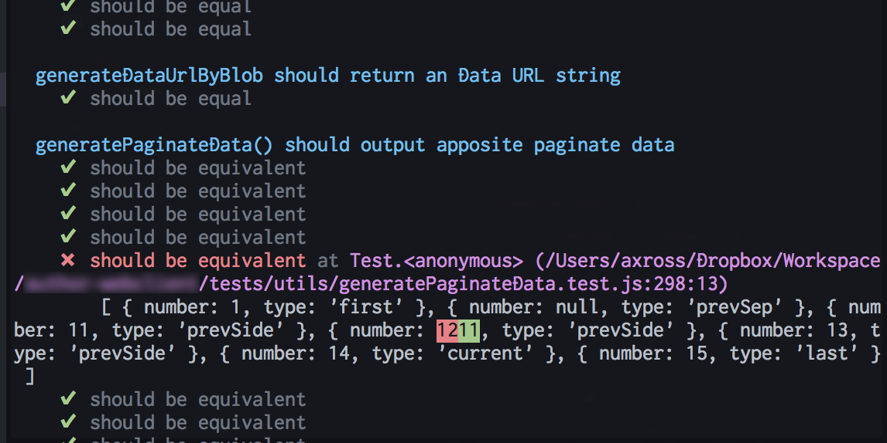
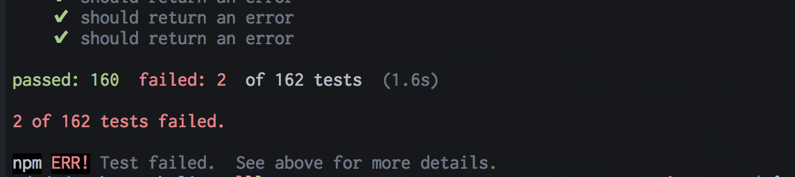

# @detools/tap-diff

[](https://badge.fury.io/js/%40detools%2Ftap-diff)
[](https://opensource.org/licenses/mit-license.php)

The most human-friendly [TAP reporter](https://github.com/substack/tape#pretty-reporters).





## How to use

You can use `@detools/tap-diff` in the same way as other [TAP reporters](https://github.com/substack/tape#pretty-reporters).

```
npm install -g @detools/tap-diff
```

```
tape ./*.test.js | tap-diff
```

`@detools/tap-diff` uses [chalk](https://www.npmjs.com/package/chalk) for adding color, which automatically detects
color terminals. If you're piping the output and want to force color:

```
FORCE_COLOR=t tape ./*.test.js | tap-diff
```

Or use with `createStream()`:

```javascript
'use strict'

const test = require('tape')
const tapDiff = require('@detools/tap-diff')

test.createStream()
  .pipe(tapDiff())
  .pipe(process.stdout)

test('timing test', (t) => {
  t.plan(2)
  t.equal(typeof Date.now, 'function')
  var start = Date.now()

  setTimeout(() => {
    t.equal(Date.now() - start, 100)
  }, 100)
})
```

## License

MIT
